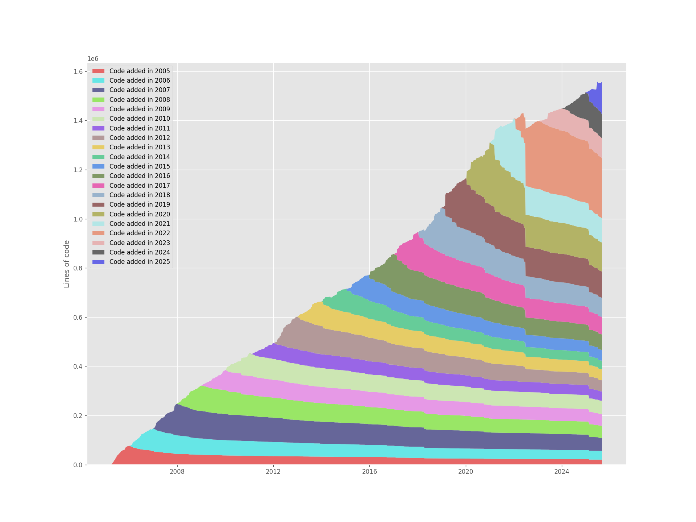
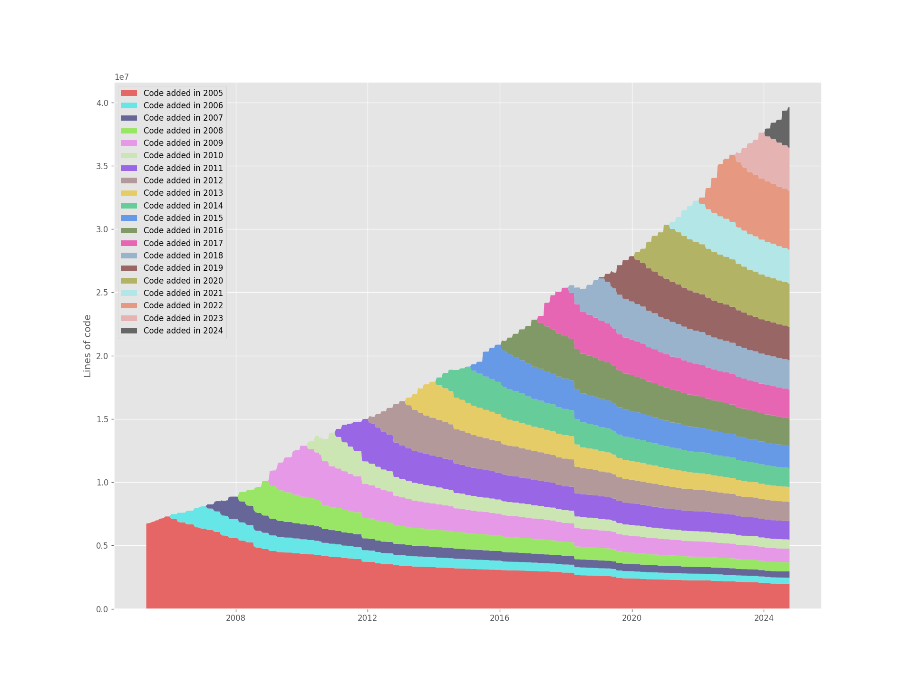

## Gix Of Theseus

A re-implementation of Erik Bern's [Git Of Theseus](https://github.com/erikbern/git-of-theseus), with fewer features but hundreds of times faster.

Generates cohort analysis graphs of git repositories over time:

Git's composition over time (6s to generate).

And the linux repo (~1 minute to generate):


It' fast because it uses a specialized algorithm (inspired from [hercules](https://github.com/src-d/hercules)) to implement its own "incremental" git blame that keeps track of results as it scans the history of the repo, and because it's written in Rust, which gives it access to the wonderful [gitoxide](https://github.com/GitoxideLabs/gitoxide) and [rayon](https://docs.rs/rayon/latest/rayon/) crates.

## Installation

Installation will be with `cargo install gix-of-theseus` once I publish the package.

For now, clone this repository and run `cargo build --release` to compile it. Then run `cargo install --path .`

`uv` is recommended to be able to run the plotting scripts "automagically".

## Usage

To get an image directly, (if you have `uv` installed):

```
gix-of-theseus ~/repos/git/git --image-file git.png
```

Will save its results to `${repo_name}.png`. Choose the output file's location with `--output-file`.
Omitting the `--plot` flag will collect the data in the same cohorts.json format but not plot it.

The plotting script from Git Of Theseus has been re-included in this repo and updated to the PEP 723 single script file standard, so you can run it with `uv` without needing pip install or a virtualenv:

```
uv run src/stackplot.py cohorts.json
# future
gix-of-theseus stackplot cohorts.json
```

# Caveats
This tool is faster because it doesn't re-implement the full feature set of Git of Theseus. Notably it doesn't:

* collect author information, or anything but the year of the commit
* plot the "memory" graph of commits
* The only behavior is `--all-filetypes`: there is no filtering to "only source code files". This is coming but not a big priority.

I plan on implementing some of these features, but they are not present yet. I don't find the author information valuable so I place a low priority on plotting it, "PRs welcome" if you really want it.

Another important caveat:
*  `.git-rev-ignore` files are not supported. 

As this is a custom blame implementation, several git features are not supported. Some of these can be filled in, but this tool is currently useful atm for a lot of repos and this doesn't seem to be a major issue.


The stackplots generated are not 100% identical with the original's output. I would say they are 98% the same, which is fine for this type of analysis.

#### Some speed comparison for fun

This is just for fun, to make the author feel good that they didn't waste all this time Rewriting It In Rust.

These are rough measurements using `time` on a M1 Max laptop, not real benchmarks. When Git of Theseus was taking too long for to wait, I gave the ETA displayed in the progress bar (after waiting for it to stabilize) and marked that result with a `~`.


| Repo | Original [s] | This repo [s] | Speedup |
|:---|---:|---:|---:|
torvalds/linux  | ~36000 | 58 | ~620x
ffmepg/ffmepg |  8195 | 7.8 | 1050x
golang/go | ~3780 | 7.0 | ~540x
grpc/grpc | ~ 3600 | 7.4 | ~486x
git/git | ~2460 | 5.1 | ~480x
apache/spark | ~1800| 6.5 | ~277x
elastic/elasticsearch | | 7.0 | 
bazelbuild/bazel | | 7.0 | 
apache/echarts | | 7.2 | 
BurntSushi/ripgrep| 15.8 | 1.4 | 11.3x
---

* git-of-theseus was run with --procs 15 (seems a little IO bound on this machine) and with the --all-filetypes flag, to match this project's behavior.

The (geometric) mean of the speedups is ~285x, though this is completely dependent on your sample, as the gap is much larger in huge, old repos.
This sample contains more of those, though it's somewhat defensible as these repos are the ones that benefit the most from these types of graphs. Whereas you don't really see a "Ship of Theseus" when running it on a personal side project that's 2 years old.

I speculate that the runtime (and the speedup) is more related to total volume of code (SLOC) in a repo, though theoretically the main improvement should be making it linear in the number of commits instead of quadratic.